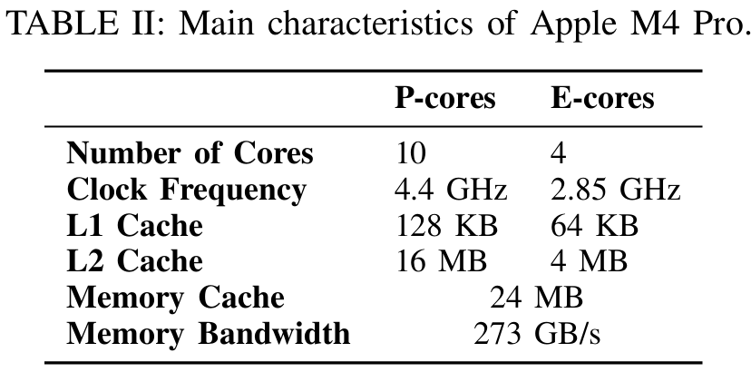
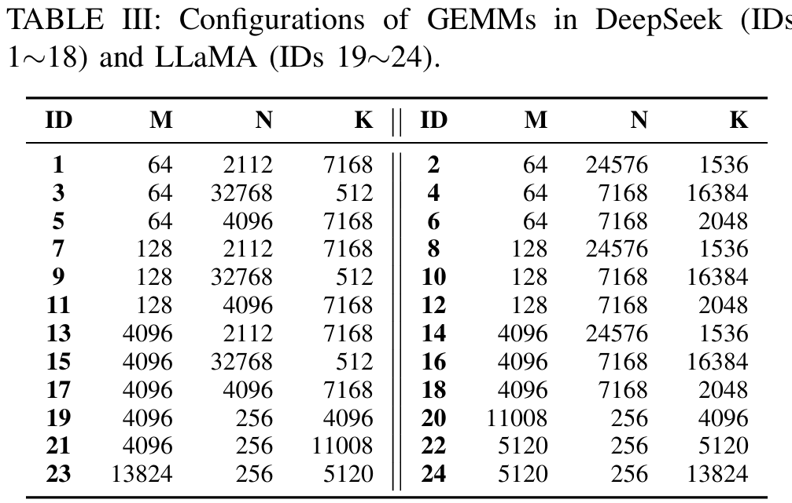
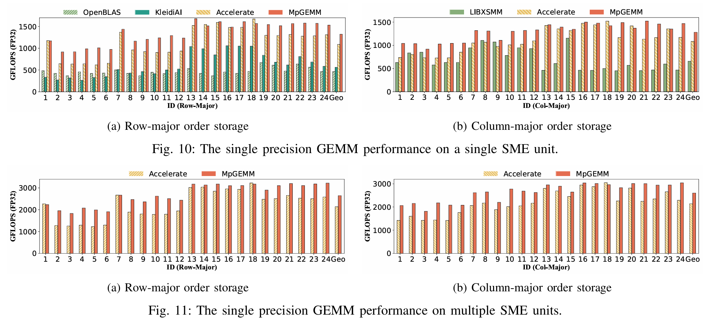
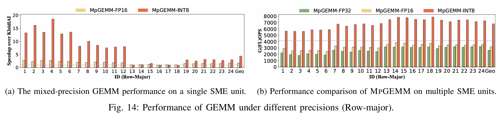

# MpGEMM

Demystifying ARM SME to Optimize General Matrix Multiplications.

This paper was published in the Proceedings of the 40th IEEE International Parallel & Distributed Processing Symposium (IPDPS '26), and you can find it here. If you find our work beneficial to your research, we would greatly appreciate it if you could cite our paper and star the repository. Please feel free to contact us at chenchengdeng@nudt.edu.cn if you have any questions.


# Abstract

MpGEMM is an open-source library that exploits the key architectural features of ARM SME to optimize GEMM across multiple precisions. Through a systematic architectural characterization of SME, we derive practical optimization guidelines that directly inform the library design. MpGEMM integrates cache-aware partitioning, efficient data packing with on-the-fly transposition, and specialized micro-kernels that utilize multi vector loads and all available tile registers.


# How to use

```
cd src
make
cd ../benchmark
make
./correct.x
./singlePerformance.x
./multiPerformance.x
./irregular.x
```

You need to adjust the values of the arrays Me, Ke, and Ne to evaluate different workloads.


# Platform and Workloads




To reflect practical use cases, we benchmark GEMM workloads derived from DeepSeek and LLaMA. The workloads include both large and skinny matrices, enabling us to evaluate performance across diverse aspect ratios.

# Performance

We compare MPGEMM against four SME-enabled GEMM implementations: Apple’s Accelerate, LIBXSMM, KleidiAI, and OpenBLAS. Experimental results demonstrate that MPGEMM achieves an average speedup of 1.23× over the vendor-optimized BLAS library in Accelerate and significantly outperforms other open source solutions.


